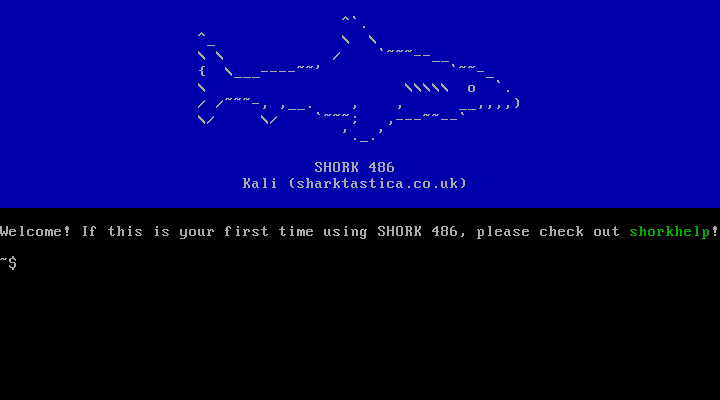

# SHORK 486

A minimal Linux distribution originally based on [FLOPPINUX's](https://github.com/w84death/floppinux) build instructions, but developed into something more automated and tailored for my usage. The aim is to produce an operating system that is very lean but functional for PCs with 486SX-class or better processors, often with my '90s IBM ThinkPads in mind. Whilst FLOPPINUX and [Action Retro's video on it](https://www.youtube.com/watch?v=SiHZbnFrHOY) provided a great basis to start with and inspired me, SHORK 486 does not offer a floppy diskette image. A raw disk drive image is built instead, as my scope includes more utilities and functionality.

A default SHORK 486 system aims to work with at least 16MiB system memory and take up no more than ~75MiB on the disk. Despite those constraints, a default SHORK 486 system offers many typical Unix/Linux commands, an FTP, SCP and SSH client, a Git source control client, the Mg (Emacs-style), nano and vi editors, basic IDE, ISA, PCI and PCMCIA NIC support, supports most major keyboard language layouts, and has a cute ASCII shark welcome screen! The build script supports many parameters to alter a SHORK 486 build to your liking. For example, if making a "minimal" build, the RAM requirement and disk size can be brought down to 12MiB and ~10MiB, respectively, whilst still including the typical commands as before, the vi editor, and basic networking support. Some people have expressed support for using SHORK 486 on newer hardware for a minimalist Linux environment, and as such, build parameters for enabling high memory, SATA and SMP support are provided if you so desire them!

## Capabilities

### Core commands (BusyBox, util-linux)

awk, basename, beep, cat, chmod, chown, chroot, clear, cp, crontab, cut, date, dmesg, dirname, find, fold, free, ftpget, ftpput, gzip, halt, head, hostname, ifconfig, kill, less, ln, ls, lsblk, lspci, loadkmap, man, mkdir, mknod, mount, mv, nice, nohup, nproc, paste, pkill, ping, printf, pwd, readlink, rm, rmdir, route, sed, seq, showkey, sleep, stat, stty, sync, tar, tee, test, top, touch, tr, udhcpc, umount, uname, unzip, whoami, wget, which, xz

### Bundled software

* ftp (FTP client, tnftp)
* emacs (text editor, [Mg](https://github.com/troglobit/mg))
* git (Git source control client)
* nano (text editor)
* scp (SCP client, [Dropbear](https://github.com/mkj/dropbear))
* ssh (SSH client, [Dropbear](https://github.com/mkj/dropbear))

### Custom utilities 

* **shorkcol** - Persistently changes the terminal's foreground (text) colour. Takes one argument (a colour name); running it without an argument shows a list of possible colours.
* **shorkfetch** - Displays basic system and environment information. Similar to fastfetch, neofetch, etc. Takes no arguments.
* **shorkhelp** - Provides help with using SHORK 486 via command lists, guides and cheatsheets. Requires one of five parameters:
    * `--commands`: Shows a command list including core commands and utilities, SHORK 486 utilities, bundled software, and supported Git commands.
    * `--emacs`: Shows an Emacs (Mg) cheatsheet.
    * `--git`: Shows a list of supported Git commands.
    * `--intro`: Shows an introductory paragraph for SHORK 486 and a simple getting started guide.
    * `--shorkutils`: Shows a list of SHORK 486 utilities with a brief explanation of what they do.
* **shorkmap** - Persistently changes the system's keyboard layout (keymap). Takes one argument (a keymap name); running it without an argument shows a list of possible keymaps.
* **shorkoff** - Brings the system to a halt and syncs the write cache, allowing the computer to be safely turned off. Similar to `poweroff` or `shutdown -h`. Takes no arguments.
* **shorkres** - Persistently changes the system's display resolution (provided the hardware is compatible). Takes one argument (a resolution name); running it without an argument shows a list of possible resolution names.

## Hardware requirements

### What is "default"?

A "default SHORK 486 build" or "default SHORK 486 system" mentioned in various sections following refers to when the build script is run without any parameters that add or remove programs or features. Essentially, its a typical build.

### CPU

An **Intel 486SX** is the minimum processor requirement. Math emulation is enabled, so a 486DX or a separate co-processor is not required (although still supported and desirable).

### RAM

**16MiB** is the minimum system memory for a default SHORK 486 build. **24MiB** is the recommended amount for some comfortable headroom for programs. SHORK 486 is bootable with **as little as 12MiB**, but there will be very little free memory for programs. If you are constrained to that amount, using the "minimal" build parameter or at least using build parameters to skip including network-based programs and features is recommended.

### Hard drive

Even the most complete SHORK 486 system with all optional features enabled will require no more than a **~75MiB** disk. Using the "minimal" build parameter will reduce this requirement to **~10MiB**, or selectively using skip bundled program or feature parameters can produce a system in between those two numbers.

### Graphics

Only a basic **IBM VGA display card or compatible** is required for using SHORK 486. If a more capable card is present though, the `shorkres` utility can offer SVGA or XGA resolution support.

### Modern hardware

SHORK 486 can be used on newer hardware if you so desire, but there are some considerations and some optional build parameters that may be required for the best experience:

* SHORK 486 can work with newer x86 processors, although a default SHORK 486 build will not recognise more than 1 core/thread. An "enable SMP" build parameter is available to enable symmetric multiprocessing support. Whilst SHORK 486 can work on an x86-64 processor, the system is still limited to supporting 32-bit software.

* A default SHORK 486 system will not recognise more than ~875MiB of memory. An "enable high memory" build parameter is available to address this, though the minimum system memory requirement is raised to **24MiB**.

* A default SHORK 486 system only supports IDE hard drives. An "enable SATA" build parameter is available to address this, though the recommended system memory amount is raised to **24MiB**.

* The "maximal" build parameter is available as a shortcut to enable all three parameters mentioned above (as well as all possible software).

## Usage

Please read "Notice & disclaimers" at the end of this readme before proceeding. Building SHORK 486 may require up to 4GiB of disk space.

### Native building

If you are using an Arch or Debian-based Linux, run `build.sh` whilst in the `shork486` directory and answer any prompts given throughout the process. Build parameters are listed in the "Scripts & parameters" section of this readme that can be used to reduce the need for the aforementioned prompts.

### Dockerised building

If you are using Windows, macOS, a Linux distribution that has not been tested with native building, or want some kind of "sandbox" around the build process, you can try Dockerised building instead. It will create a Docker container with a minimal Debian 13 installation that is active for just the lifetime of the build process. Run `docker-compose up` whilst in this repository's directory (not `shork486`).

Build parameters as seen in the "Scripts & parameters" section can also be used for Dockerised building, placed in a list under `services` -> `shork486-build` -> `command` inside `docker-compose.yml`. If a build run has already been made, you may need to run `docker-compose up --build` instead before any changes are applied.

### Build process

The following describes the build process as it is by default (no build parameters used).

1. The user is prompted to choose if their host environment is Arch or Debian-based. Packages required for the build process are installed based on the host environment choice.

2. An i486 musl cross-compiler is downloaded and extracted.

3. BusyBox is downloaded and compiled. BusyBox provides SHORK 486 with Unix-style utilities and an init system in one executable. BusyBox's compilation is used as the basis for SHORK 486's root file system in `build/root`.

4. The Linux kernel is downloaded and compiled. `configs/linux.config` is copied during this process, which provides a minimal configuration tailored to support 486SX, PATA/IDE storage devices and basic networking without any further modification or build parameters. The output is `build/bzImage`.

5. ncurses and tic are downloaded and compiled. These are prerequisites required for further program compilation and for SHORK 486 utilities.

6. All bundled software and their required libraries are downloaded and compiled.

7. After compilation, any possible fat will be trimmed to save space (mostly, this is documentation, man pages and templates).

8. Building the root file system is continued. This largely involves creating all required subdirectories, copying all of `sysfiles` contents and SHORK 486 utilities (in `utilities`) to their relevant places within `build/root`. Keymaps, the PCI IDs database and any configuration files for bundled software are also installed at this point.

9. A raw disk drive image (`images/shork486.img`) is built, with the root file system copied in and a bootloader installed.

10. `qemu-img` is used to produce a VMware virtual machine disk (`images/shork486.vmdk`) based on the raw disk drive image.

### After building

Once built, two disk images - `shork486.img` and `shork486.vmdk` - should be present in the `images` folder. The former can be used as-is with emulation software like 86Box or written to a real drive using (e.g.) `dd`, and the latter can be used as-is with VMware Workstation or Player. Please refer to the "Running" section for suggested virtual machine configurations to get started with SHORK 486.

It is recommended to move or copy the images out of this directory before extensive or serious use because they will be replaced if the build process is rerun.

## Scripts & parameters

* `build.sh`: Contains the complete download and compilation process that reproduces a working SHORK 486 system on two disk images. The following parameters are supported:

* `clean.sh`: Deletes anything that was downloaded, created or generated by `build.sh`.

### Build parameters

#### Core configuration

* **Minimal** (`--minimal`): can be used to skip building and including all non-essential features, producing a ~10MiB or less disk drive image and a potentially less memory-hungry SHORK 486 system.
    * This is like using the "no boot menu", "skip Dropbear", "skip Emacs", "skip Git", "skip nano", and "skip tnftp" parameters together.
    * The "enable high memory", "enable SATA", "enable SMP", "enable USB & HID", "skip kernel", "skip BusyBox", and "use GRUB" parameters will be overridden if also used.
    * The minimum system memory requirement is lowered to 12MiB.

* **Maximal** (`--maximal`): can be used to force building and including all bundled programs and features.
    * This is like using the "enable high memory", "enable SATA", "enable SMP" and "enable USB & HID" parameters together.
    * All skip bundled program/feature, "minimal", "skip kernel" and "skip BusyBox" parameters will be overridden if also used.
    * The "use GRUB" parameter is the one major feature control that is still optional.
    * The minimum system memory requirement is raised to 24MiB.

* **Set keymap** (`--set-keymap`): can be used to specify SHORK 486's default keyboard layout (keymap). 
    * Example usage: `--keymap=de` to specify a German QWERTZ keyboard layout. Possible keymaps can be found in the `sysfiles/keymaps` directory (just exclude the `.kmap.bin` extension).
    * If absent, U.S. English is used as the default keyboard layout.
    * This does nothing if the "skip keymaps" parameter is also used.

* **Target MiB** (`--target-mib`): can be used to specify a target total size in mebibytes for SHORK 486's disk drive images.
    * Example usage: `--target-mib=75` to specify a 75MiB target size.
    * The build script will always calculate the minimum required disk drive image size, and if the target is below that, it will default to using this calculated size.
    * Whilst the raw image (`.img`) will be created to this size, the VMware virtual machine disk (`.vmdk`) dynamically expands, so it may initially take up less space.

#### Build automation

These parameters help automate the use of the build script, especially for successive runs. Note that some of these should be used wisely! The "skip kernel" and "skip BusyBox" parameters are useful for speeding up successive builds that differ only by their sysfiles and recompiling previously bundled programs, but any changes to their respective `.config` files or any manual patches made in the build script will not be applied and "stale" compilations will be used, and any skip bundled program parameters will not have an effect.

* **Always (re)build** (`--always-build`): can be used to ensure the kernel is always (re)built. This will skip the prompt that appears if the kernel is already downloaded and built, acting like the user selected the "Reset & clean" option.
    * This does nothing if the "skip kernel" parameter is also used.

* **Is Arch** (`--is-arch`): can be used skip the host Linux distribution selection prompt and the build script will assume it is running on an Arch-based system.

* **Is Debian** (`--is-debian`): can be used skip the host Linux distribution selection prompt and the build script will assume it is running on a Debian-based system.

* **Skip kernel** (`--skip-kernel`): can be used to skip recompiling the kernel.
    * This parameter requires at least one complete build.
    * This does nothing if the "minimal" Aparameter is also used.

* **Skip BusyBox** (`--skip-busybox`): can be used to skip recompiling BusyBox.
    * This parameter requires at least one complete build.
    * This does nothing if the "minimal" parameter is also used.

#### Bundled programs and features

These parameters can be used to include, exclude (skip) or select specific bundled programs and features.

* **No boot menu** (`--no-menu`): can be used to remove SHORK 486's boot menu.
    * This will save ~512KiB to the boot file system. SHORK 486 will no longer provide the option to boot in a debug/verbose mode.

* **Skip Dropbear** (`--skip-dropbear`): can be used to skip downloading and compiling Dropbear.
    * This will save ~404KiB and 2 files on the root file system. SHORK 486 will lose SCP and SSH capabilities.
    * This does nothing if the "skip kernel" or "skip BusyBox" parameters are also used.

* **Skip Emacs** (`--skip-emacs`): can be used to skip downloading and compiling Mg ("Micro (GNU) Emacs"-like text editor).
    * This will save ~329KiB and 3 files on the root file system. `ed`, `vi` (always) or nano (can also be removed) are available are alternative editors.
    * This does nothing if the "skip kernel" or "skip BusyBox" parameters are also used.

* **Skip Git** (`--skip-git`): can be used to skip downloading and compiling Git and its prerequisites (zlib, OpenSSL and curl).
    * This will save ~19MiB and 192 files on the root file system. SHORK 486 will lose its git client.
    * This does nothing if the "skip kernel" or "skip BusyBox" parameters are also used.

* **Skip keymaps** (`--skip-keymaps`): can be used to skip installing keymaps.
    * This will save ~64KiB and 26 files on the root file system. SHORK 486 will stop supporting keyboard layouts other than ANSI U.S. English. `shorkmap` will not be included.
    * This does nothing if the "skip BusyBox" parameter is also used.

* **Skip nano** (`--skip-nano`): can be used to skip downloading and compiling nano.
    * This will save ~902KiB and 53 files on the root file system. `ed`, `vi` (always) or Mg (can also be removed) are available are alternative editors.
    * This does nothing if the "skip kernel" or "skip BusyBox" parameters are also used.

* **Skip pci.ids** (`--skip-pciids`): can be used to skip building and including a `pci.ids` file.
    * This will save ~115-125KiB and one file on the root file system. `shorkfetch` will lose its "GPU" field.
    * GPU identification on some 486SX configurations can take a while, so excluding this may be desirable to speed up `shorkfetch` significantly in such scenarios.

* **Skip tnftp** (`--skip-tnftp`): can be used to skip downloading and compiling tnftp.
    * This will save ~304KiB and 3 files on the root file system. SHORK 486 will lose FTP capabilities.
    * This does nothing if the "skip kernel" or "skip BusyBox" parameters are also used.

* **Use GRUB** (`--use-grub`): can be used to install a GRUB 2.x bootloader instead of EXTLINUX. This is intended as a diagnostic step when EXTLINUX fails to boot on certain systems.
    * This will add ~13MB to the boot file system.
    * This does nothing if the "minimal" parameter is also used.

#### Modern kernel features

These parameters enable kernel-level support for features required by modern hardware. SHORK 486 is not intended to be used on such, but given some interest in using it as a minimal Linux environment on modern hardware, these are provided to help accommodate such. :)

* **Enable high memory** (`--enable-highmem`): can be used to enable high memory support in the Linux kernel and declares that non-reserved physical memory starts at 16MiB instead of 1MiB. In general, this is provided in case someone wanted to try SHORK 486 on a more modern system with >875MiB RAM (it is not normally needed for any 486-era (or indeed '90s) hardware), or if reserved physical memory for any system exceeds 1MB for some reason.
    * The minimum system memory requirement is raised to 24MiB.
    * This does nothing if the "minimal" or "skip kernel" parameters are also used.

* **Enable SATA** (`--enable-sata`): can be used to enable SATA AHCI support in the Linux kernel. This is provided in case someone wanted to try SHORK 486 on a more modern system with SATA devices - it is not needed for any 486-era (or indeed '90s) hardware.
    * This may add ~5-7MiB to idle RAM usage. Whilst SHORK 486 with SATA support should still be bootable with 16MiB system memory, very little will be left for programs, thus 24MiB or more is now recommended.
    * This does nothing if the "minimal" or "skip kernel" parameters are also used.

* **Enable SMP** (`--enable-smp`): can be used to enable symmetric multiprocessing (e.g., multi-core) support in the Linux kernel. This is provided in case someone wanted to try SHORK 486 on a more modern system with a multi-core processor - it is not needed for any 486-era (or indeed '90s) hardware.
    * This may add ~1-2MiB to idle RAM usage.
    * This does nothing if the "minimal" or "skip kernel" parameters are also used.

* **Enable USB & HID** (`--enable-usb`): can be used to enable USB and HID support in the kernel and for lsusb to be included with BusyBox. This is provided in case someone wanted to try SHORK 486 on a system with USB peripherals and/or mass storage devices.
    * This will add ~156KiB and 1 file on the root file system.
    * This does nothing if the "minimal", "skip BusyBox" or "skip kernel" parameters are also used.

## Directories

* `build`: Contains the root file system and kernel image created by the build process.
    * Created after a build attempt is made.
    * Do not directly modify or add files to this directory, as the directory may be deleted and recreated upon running the build script again.

* `configs`: Contains my Linux kernel and BusyBox `.config` files that are copied into their respective source code directories before compilation, and a helper when compiling a binary that should be static not dynamic.

* `images`: Contains the result raw disk drive images created at the end of the build process.
    * Created after a build attempt is made.

* `sysfiles`: Contains important system files to be copied into the Linux root file system before zipping.

## Running

### Real hardware

TODO.

### 86Box

86Box should be able to create many vintage machine configurations to test with. Below is a suggested configuration for the lowest-end machine SHORK 486 should be able to run on:

* Machine
    * **Machine type:** [1994] i486 (Socket 3 PCI)
    * **Machine:** [i420EX] Intel Classic/PCI ED (Ninja)
    * **CPU type:** Intel i486SX
    * **Frequency:** any option
    * **FPU:** any option
    * **Memory:** at least 16MB for default build (24MB or more recommended)
* Display
    * **Video:** [ISA] IBM VGA
* Input
    * **Keyboard:** AT Keyboard
* Network
    * Network Card #1
        * **Mode:** SLiRP
        * **Adapter:** [ISA16] AMD PCnet-ISA
* Storage controllers
    * Hard disk
        * **Controller 1:** Internal device
* Hard disks
    * Existing...
        * **Bus:** IDE
        * **Channel:** 0:0
        * **Model:** any [Generic] should be fine

You can configure sound, ports, floppy and CD-ROM drives however you wish. Just avoid any SCSI components.

### VMware Workstation

SHORK 486 should work with VMware Workstation without issue. Below is a suggested virtual machine configuration:

* **Hardware compatibility:** any option
* **Install operating system from:** later
* **Guest Operating System:** Linux (Other Linux 6.x kernel)
* **Number of processers:** 1
* **Number of cores per processor:** 1 (technically any option, extra will not be utilised)
* **Memory:** at least 16MB for default build (24MB or more recommended)
* **Network Connection:** any option (only NAT presently tested though)
* **I/O Controller Types:** BusLogic
* **Virtual Disk Type:** IDE
* **Disk:** Use an existing virtual disk

## Notice & disclaimers

Running `build.sh` for native compilation will automatically perform several tasks on the host computer and operating system, including enabling 32-bit packages (Debian), installing prerequisite packages, modifying PATH, and creating some environment variables. If you intend to use this yourself, please note that this is tailored for my personal usage. Please review what the script does to ensure it does not conflict with your existing configuration. Alternatively, consider Dockerised compilation to minimise impact to your host operating system.

Running `clean.sh` will delete everything `build.sh` has downloaded, created or generated, including the `build` folder and its contents. `.gitingore` indicates what would be deleted. If you made any manual changes to or in a file or directory covered by that, they will be lost.

At present, you are always the root user when using SHORK 486. Make sure to act and use it considerately and responsibly.
